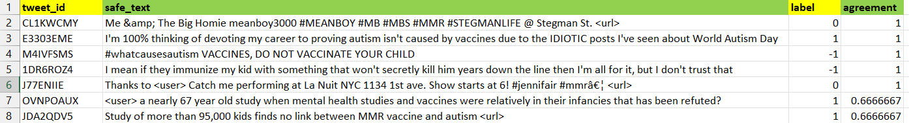
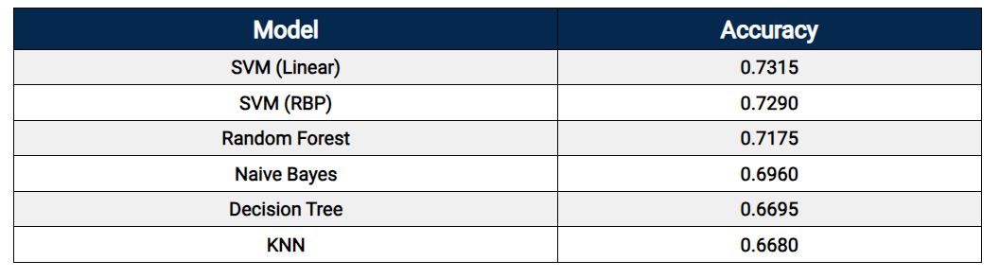
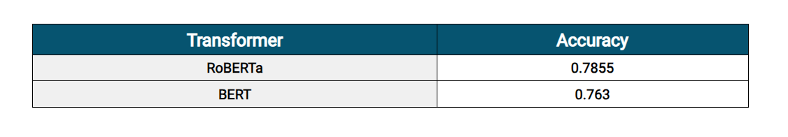

<h1>Sentiment Analysis of Vaccination Data with Data Analysis</h1>  

Code to do the sentiment analysis of the vaccination data and later use it to do the data analysis of the unseen text. Following repository contains the data in the <i>"data"</i> folder, a set of jupyter notebooks containing the code to train and test the models in the <i>"code"</i> folder and finally a report <i>"Report.pdf"</i> that details about the work along with the analysis done on the data.

<!-- *********************************************************************** -->

<h1>Data</h1>
The data is contained in the "data" folder. It contains the set of tweets with their tweet ID. the tweets are regarding the vaccination and they beelong to the three categories: positive(+1), negative(-1) or neutral(0). These three polarities determine the mood or perception of the people regarding the vaccination. Another file in the folder contains just the tweets only and an attempt has been made to do the data/text analysis for vaccination from the given text after doing the sentiment analysis of using the best model trained and doing the analysis henceforth.
  

<b>Data Sample</b> 
 

  

<!-- *********************************************************************** -->

<h1>Sentiment Analysis</h1>
For sentiment analysis, first default NLTK and textblob packages were used to check their performance, but their accuracy were very poor on vaccination data. Following table shows the performance of the libraries on the vaccination data. Libraries methods were made to predict on validation data and compared against the groundth truth and hence accuracy was measured.
  

 

<b>NLP standard libraries performance</b> 

 

So separate new models were trained using both Machine Learning and Deep Learning models and they were compared against each other. For Deep Learning, transformer 
models were used and for Machine Learning different models were used and their performance were noted.
  

<b>Machine Learning models performance</b> 

 

<b>Transformer models performance</b>

  

At the end, the best model which is RoBERTa here, is selected and it is tested on the unseen data for doing the data analysis or text analysis.

  

<!-- *********************************************************************** -->

<h1>Data/Text Analysis</h1>

A corresponding report is made and present along side the data and code for the analysis of the data using both text and the model trained.
 

Different plots and charts are made after the inference through the model as well as studying out patterns and relationships between the results and raw text.
 

Below pie chart, shows the distribution of the sentiment of tweets on some unseen data 

 

<b>The top trends in the negative sentiment tweets</b>

 
The relevant text are filtered that are viewed and analysed what are the reasons, patterns and knowledge during the analysis of the text.